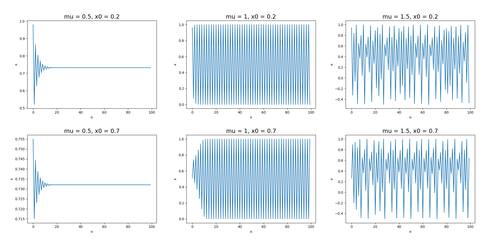
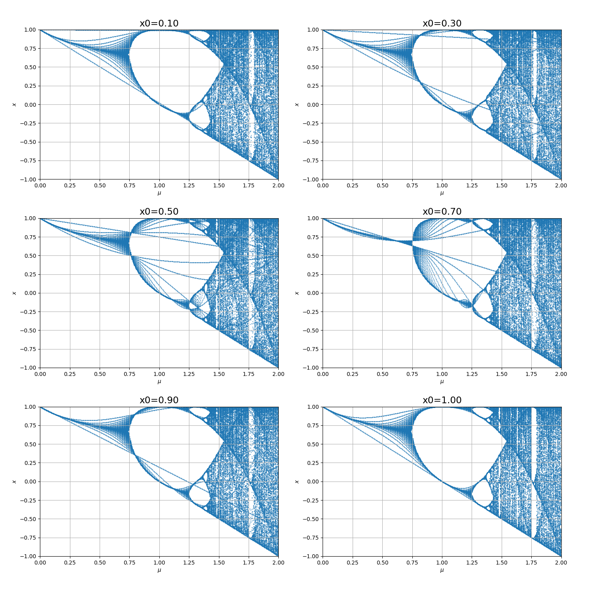
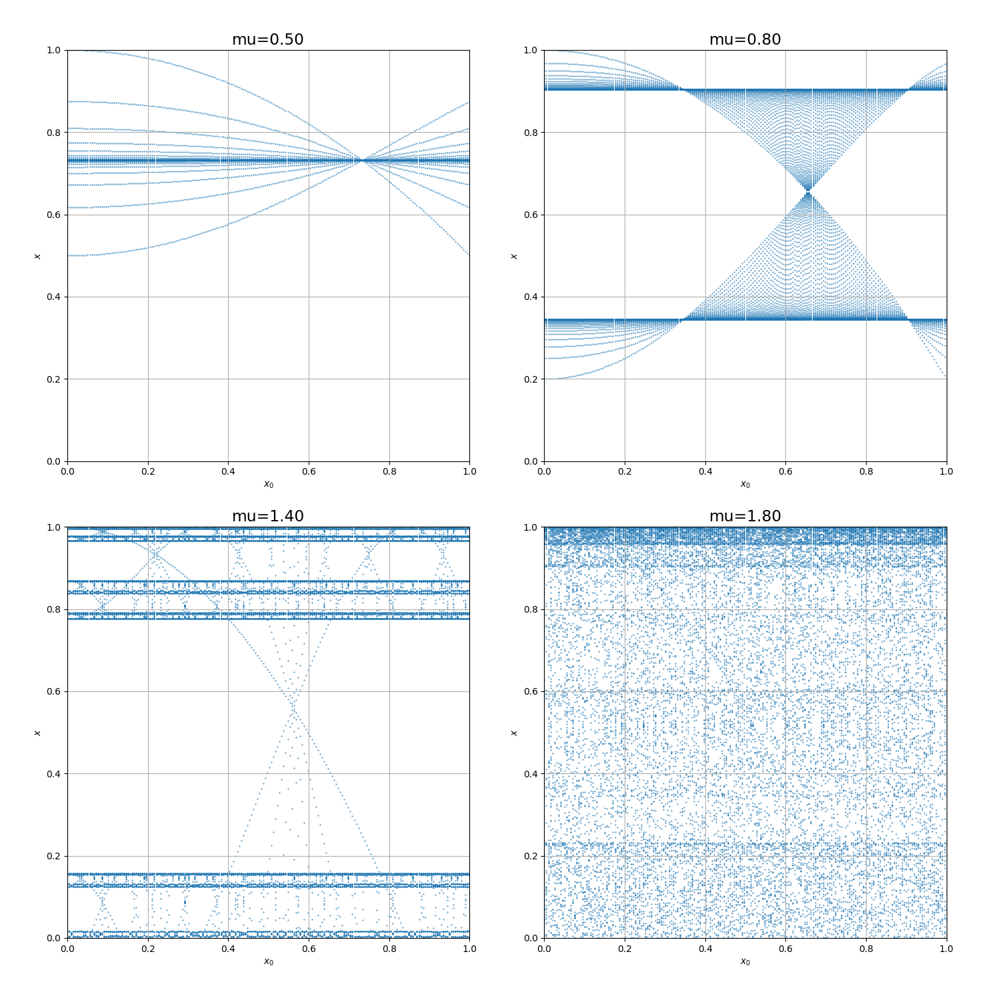
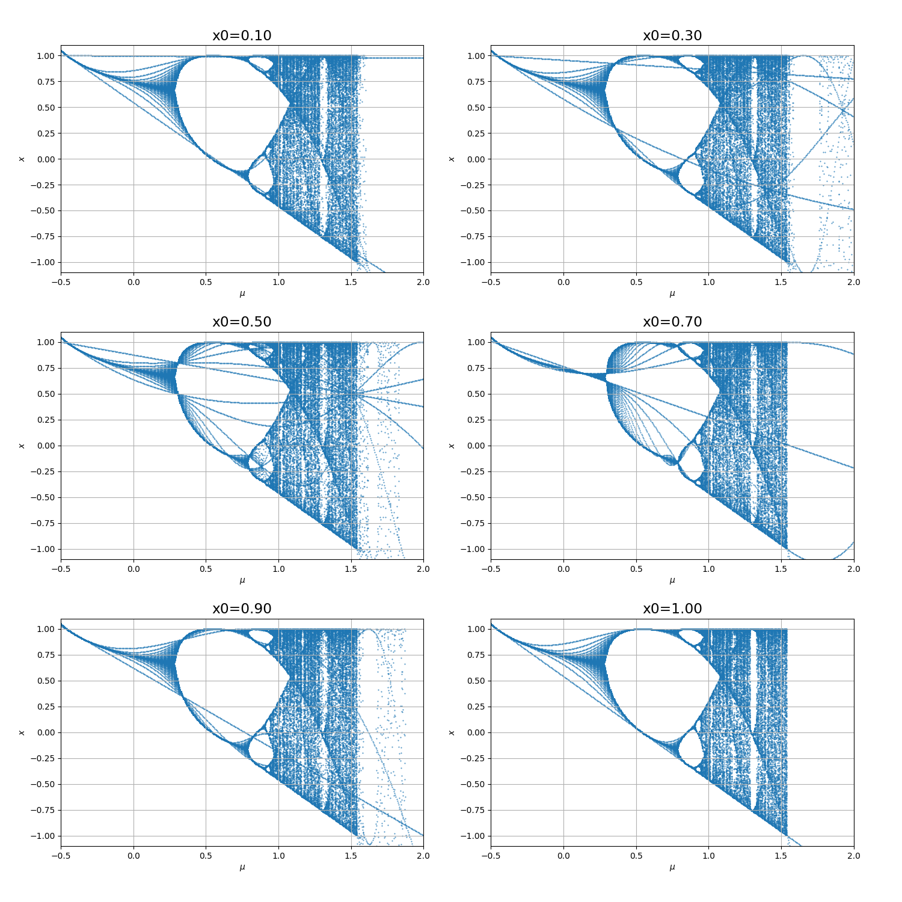
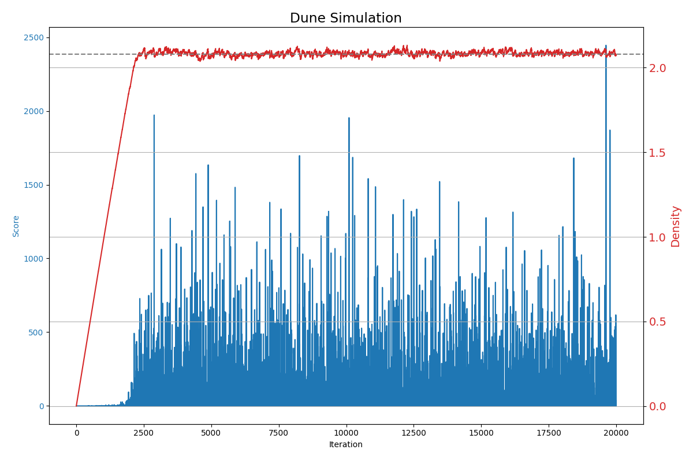
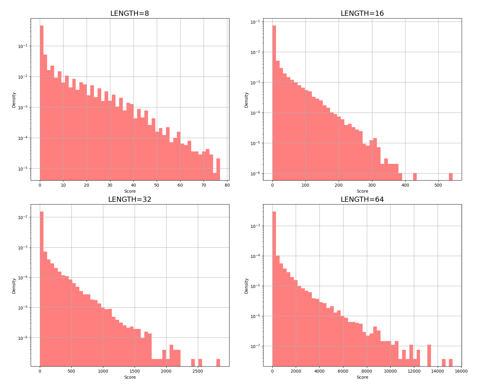

# 计算物理导论 HW1

## 虫口模型和 Logestic 映射

### 1. 迭代方程 $x_{n+1} = 1 - \mu x_n^2$

题干要求分析不同 $\mu \in (0,2)$ 下 $x_n$ 的长时间行为，以及其与初值 $x_0 \in (-1, 1)$ 的关系。

#### 预先分析
1. 由迭代方程的形式，超参数 $x_0$ 和 $-x_0$ 构造的序列除了第一项应该完全一致。
2. 考虑到这里有一个序列 `[(n,x), ...]` 和两个超参数 `x0, mu`，需要对数据进行降维展示处理。题干要求研究 `[(n,x), ...]` 的长时间行为，因此，序列本身不是重要的，可以将其视为一个点集。

#### 计算结果
1. 横轴为 $n$，纵轴为 $x_n$。在这里，我们尝试了 3*2 组数据，结果表明在长时间下，可能会出现：**稳定**、**振荡**或者**混沌**的三种情况：
    1. $\mu = 0.5$：稳定，收敛到 $x_* \approx 0.732$，此处为不动点 $\sqrt{3}/3$ 所在处。
    2. $\mu = 1$：振荡，存在子列收敛到 $x_{*1} = 0$ 和 $x_{*2} = 1$。
    3. $\mu = 1.5$：混沌，没有收敛点，或者说存在无穷多的收敛子列。

    在稳定和震荡的情况下，$x_0$ 仅仅影响收敛的速度，而在混沌的情况下，$x_0$ 影响收敛的子列的个数和分布。之后的程序结果可以证实这一点。

2. 横轴为 $\mu$，纵轴为 $x$，超参数控制为 $x_0$，将一组 `(x0, mu)` 对应的 $x_n$ 叠加在一起，形成一个二维的分布图像（下图为叠加了 200 次的散点图）。由这张图可以看到，不同的 $x_0$ 仅仅改变的其收敛的速度。**定性分析**：
    1. $\mu < 0.75$: 此时仅有一个不动点。
    2. $\mu \in (0.75,1.25)$: 此时有两个不动点。
    3. $\mu > 1.25$: 以此类推，出现越来越多的不动点，最后趋向混沌。在这里，我们可以明显的看到倍周期分叉现象。

3. 横轴为 $x_0$，纵轴为 $x$，超参数控制为 $\mu$，将一组 `(x0, mu)` 对应的 $x_n$ 叠加在一起，形成一个二维的分布图像（下图为叠加了 200 次的散点图）。由这张图可以清晰地看到，不同的倍周期分叉中 $x_n$ 向不动点收敛、趋于混沌的过程。在图中我们可以看到，离不动点越远的 $x_0$ 其收敛到不动点的过程就越长，具体展现在其有更多的点列。

### 2. 迭代方程 $x_{n+1} = \cos x_n - \mu x_n^2$

#### 预先分析

由泰勒展开，$\cos x \approx 1 - \frac{1}{2} x^2$，因此 $\cos x_n$ 的存在使得当 $\mu > 1.5$ 的时候，可能导致 $x$ 发散。同时，在 $\mu > -0.5$ 时可能不发散。

#### 计算结果

计算机计算结果表明预先分析是正确的。模拟与理论不符的原因是高阶小量的问题。整体来看，改进的迭代方程和原迭代方程的结果近似做了一个 mu 的平移。



## 消消乐游戏

### 1. ⽹格平均⽅块密度随时间关系



**我的发现**:
1. 在开始的 2500 左右步长中，网格平均方块密度近似线性递增。
2. 在后面的步数中，网格平均方块密度趋于平稳，且在 2.08 附近震荡。

### 2.3. 不同大小长时演化中得分的频率分布 P(s)

在这里，我们默认使用 10000 步之后的数据进行分析，以避免包含初始的不平衡过程。每种大小的地图均模拟 100000 步。



**规律的定性总结**:
1. score 近似满足指数率分布。在上面的图像中，指数律体现在分布随着 score 的增大线性减少。
2. 在 score 分布的尾部，出现了显著低于指数分布律的偏差。
3. 随着地图大小的增大，score 在尾部的偏差逐渐减小，趋近于较完美的指数分布。
4. 随着地图大小的增大，score 的期望逐渐增大，同时概率随着 score 的增长降低得越慢。

### 4. 思考与总结

- 从系统的平衡来说，在长时间的演化后，随机的方块注入和雪崩造成的流失趋于平衡，使得系统的平均方块密度趋于平稳。
- 同时，由于边缘效应，落在边缘地的方块不容易引起较大的雪崩，这种限制导致了 score 在较大的一端偏离了指数分布。


<!-- ## 源代码

```bash
hw1/
├── hw1.md
├── logestic.py
└── sand.py
```

```python
# logestic.py
```

```python
# sand.py
``` -->